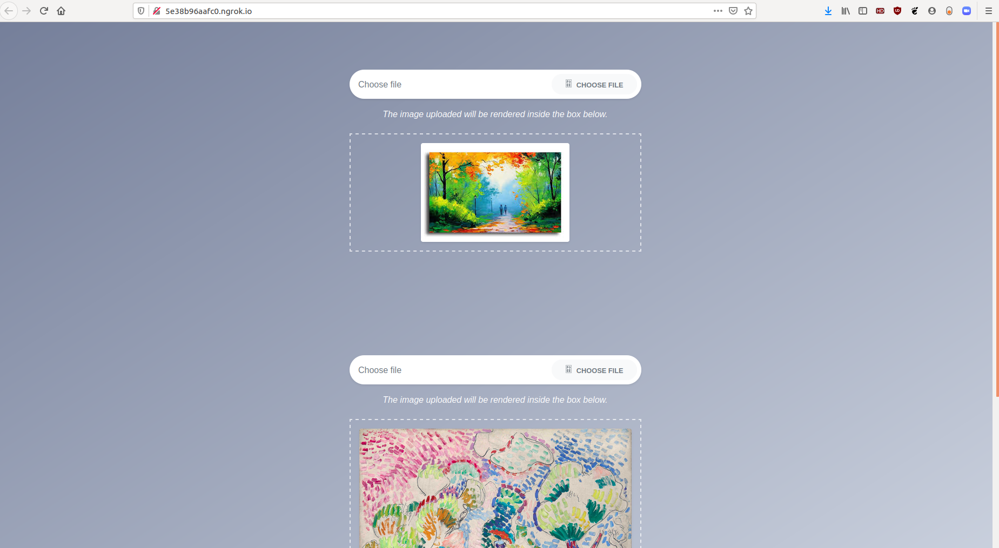
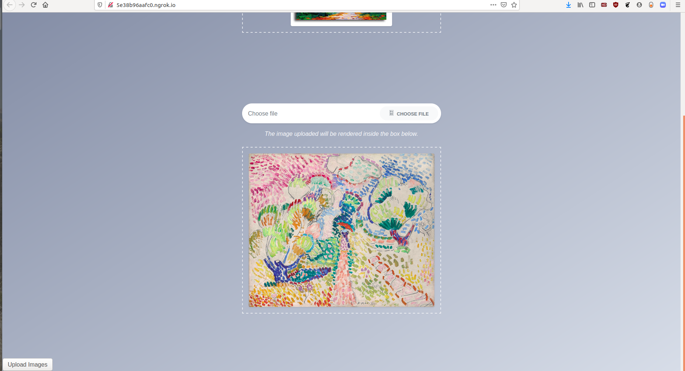
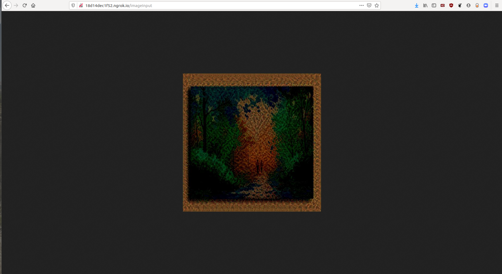

# NeuralArtTransfer
Practice implementation of "A Neural Algorithm of Artistic Style (Gatys et al.)."A very basic frontend service is developed that accepts the content and style images and displays the resultant images.

content Image :

style Image :

resultant Image :

# Build Steps

1) Download the templates and static folder from the content folder and upload it to your google drive.
2) Update the UPLOAD folder, template folder and static folder path in Flask or simply follow this folder structure in your drive:
 `template folder = drive/My Drive/NeuralArtTransfer/templates`
 `static_folder='drive/My Drive/NeuralArtTransfer/static'`
 `UPLOAD_FOLDER = 'static/uploads/'`
 
# Requirements

1) Google Colab with GPU support
 
 # Future Work
 
 Currently the neural art transfer model only works with PNG images.Further improvements will be made to support other image formats. I would also like to deploy it on a cloud service provider like AWS where everyone can access the service.
 

